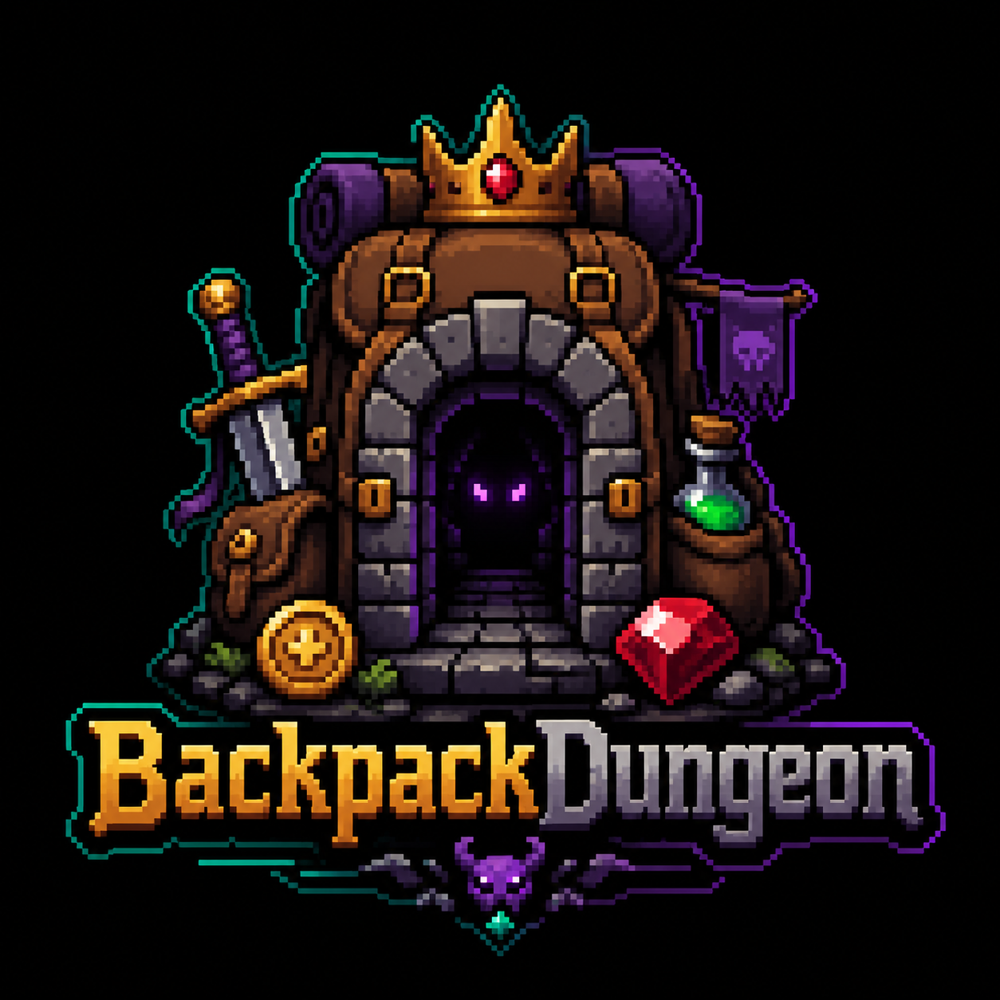

# BackpackDungeon

BackpackDungeon is a Solana-based pnpm monorepo project for the Packrun game infrastructure. It includes on-chain Anchor programs, a deterministic game logic engine, shared type libraries, and a web frontend.

## Project Pitch Deck

[Simplified Chinese Version](BackpackDungeon_Pitch_Deck_CN.pptx)

[English Version](BackpackDungeon_Pitch_Deck_EN.pptx)


## Quick Start

### Prerequisites

- Node.js >= 18
- pnpm >= 10
- Solana CLI
- Anchor CLI >= 0.32.1

### Setup & Build

```bash
# 1. Install dependencies for all packages in the monorepo
pnpm install

# 2. Build all packages (shared → game-core)
pnpm build

# 3. Run game logic unit tests
pnpm --filter @backpack-dungeon/game-core test
pnpm --filter @backpack-dungeon/shared test
```

### Run Tests

```bash
# Run game logic integration tests (no local validator required)
node --experimental-strip-types --test tests/packrun.gameplay.test.mjs

# Run tests with the one-click script
./start.sh --test

# Run Anchor integration tests (local validator required)
NO_DNA=1 anchor test
```

### Start the Development Environment

```bash
# Option 1: One-click startup (build → validator → deploy → web)
./start.sh

# Option 2: Skip the Anchor build
./start.sh --skip-build

# Option 3: Start only the web frontend (assuming the validator is already running)
./start.sh --web-only

# Clean build artifacts
./start.sh --clean
```

All random outcomes for the daily map are derived from a numeric seed. The default value is maintained in `packages/game-core/src/daily-config.ts`, and it can also be overridden at startup:

```bash
PACKRUN_RANDOM_SEED=123456 ./start.sh
PACKRUN_DAY_ID=2026-04-26 PACKRUN_RANDOM_SEED=123456 ./start.sh
```


### Start the Web Frontend Separately

```bash
pnpm --filter @backpack-dungeon/web dev
```

## Available Scripts

| Command | Description |
|------|------|
| `pnpm build` | Build all packages |
| `pnpm test` | Run tests for all packages |
| `pnpm dev:web` | Start the Next.js development server |
| `pnpm test:gameplay` | Run game logic integration tests |
| `pnpm test:anchor` | Run Anchor integration tests |
| `NO_DNA=1 anchor test` | Run Anchor tests while skipping DNA |


## Project Structure

```text
BackpackDungeon/
├── apps/
│   └── web/                          # Next.js + TypeScript web frontend
│       ├── app/
│       │   ├── dungeon/
│       │   │   ├── battle-sim.ts     # Battle simulator
│       │   │   └── page.tsx          # Dungeon page
│       │   ├── layout.tsx
│       │   └── page.tsx
│       └── lib/solana/               # Solana client library
│           ├── anchorClient.ts
│           ├── constants.ts
│           ├── converters.ts
│           ├── dungeonQueries.ts
│           ├── dungeonTxs.ts
│           ├── pdas.ts
│           └── shopMath.ts
├── packages/
│   ├── game-core/                    # Deterministic game logic engine
│   │   ├── src/
│   │   │   ├── boss-shards.ts       # Boss shard logic
│   │   │   ├── daily-config.ts      # Daily map default parameters and numeric random seed configuration
│   │   │   ├── daily-map.ts         # Daily map generation
│   │   │   ├── enemy-scaling.ts     # Enemy stat scaling
│   │   │   ├── location-merkle.ts   # Location Merkle tree
│   │   │   ├── rng.ts              # Deterministic RNG
│   │   │   └── shop-logic.ts       # Shop logic
│   │   └── test/                    # Unit tests
│   ├── shared/                       # Shared types and utilities
│   │   ├── src/
│   │   │   ├── index.ts            # Type definitions, SHA-256, PDA seeds
│   │   │   └── nft-metadata.ts     # NFT metadata builder
│   │   └── test/
│   └── cnft-adapter/                # cNFT adapter with mock support
├── programs/
│   └── packrun/                     # Anchor Solana program
│       └── src/lib.rs
├── tests/
│   ├── packrun.test.mjs             # Test entry point referenced by Anchor.toml
│   ├── packrun.gameplay.test.mjs    # Game logic integration tests (68 cases)
│   └── packrun.anchor.test.mjs      # Anchor local validator integration tests
├── Anchor.toml
└── start.sh                         # One-click startup script
```


## Tech Stack

- **On-chain**: Solana + Anchor 0.32.1
- **Frontend**: Next.js 15 + React 19 + TypeScript
- **Wallet**: Solana Wallet Adapter (Phantom, Solflare)
- **Game Engine**: Pure TypeScript deterministic logic
- **Package Management**: pnpm monorepo
- **Testing**: Node.js native test runner
